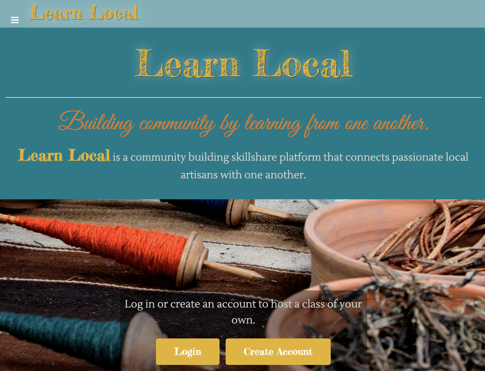

# <h1>Learn Local 2.0 </h1>

## Overview
    - A community building skillshare platform that connects passionate artisans with one another. Users can browse available classes/workshops by category or teacher. Teachers can add classes that they want to teach and update their profile.

## Pages
##### Main Page

##### Classes

  

## Contributors
- Emily Liang (wliang002)
- Hetty Chin (hetty-chin)
- Diana Lovette (birbjam)

## Features
- View classes by Teacher and Category
- Browse teachers
- Create an account, add a profile and classes you're teaching
- Map flyover for each class based on its address
- Be able to log in and log out
- Mobile responsive

## Future Development
- Class info can be updated by whoever is hosting it.
- Students can log in and see what classes they signed up for.

## Built With
- HTML
- CSS with Bootstrap
- JavaScript
- ReactJS
- MongoDB Atlas
- ExpressJS
- BCryptJS
- Mongoose
- Mapbox API
- jsonwebtoken
- concurrently

## Link To Heroku
https://learnlocal3.herokuapp.com/
